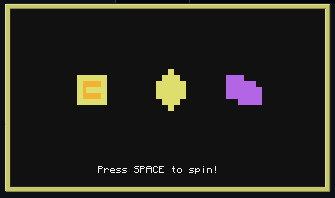

# ComputerCraft Slots

A fruit machine game for ComputerCraft.

Originally designed to interface with my secure bank system, but can be played standalone.

And yes, it's painfully unfair, as all good casinos are.

## Setup

Clone all files into the computer you want to run on.Ideally, use an advanced computer for colour support.

You also need [obsi2](https://github.com/simadude/obsi2/releases/tag/v2.2.0) on the computer, at the path `/lib/obsi2.lua`.

Attach a speaker for added addictive sound effects. You can also mount some sort of siren from your modpack to the top of the computer for a very over the top alert when someone hits the jackpot :)

Run the game by changing into the directory with your game files (e.g. `cd /slots`) and running `init.lua`.

You could also use a startup script to accomplish this with a require. You might want to use a [kiosk script](https://gist.github.com/obfuscatedgenerated/b0ce0bf1ba5eae86c273a56b0d6cf32c) to avoid players exiting the game with `Ctrl+T` without first presenting a password.

## Gameplay

Use <kbd>SPACE</kbd> to spin the reels.

If you are awarded with holds, use the corresponding number keys to hold the reels. This acts a toggle, so pressing the number key again will un-hold the reel and give you back a hold.

Check [symbols.lua](symbols.lua) for the current symbols and their payouts.
